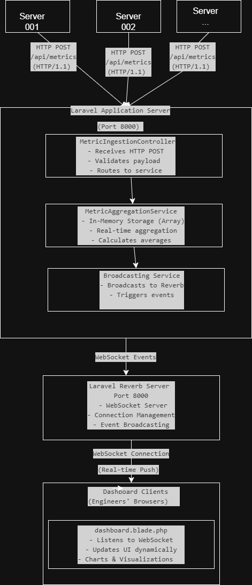

## System Overview

Our Real-Time Analytics Dashboard is designed to ingest server metrics from thousands of sources and display them in real-time to monitoring engineers. We implemented two distinct architectural approaches to compare different backend patterns and protocols.

### High-Level Requirements
- **Metric Ingestion**: Accept metrics from 10,000 servers sending data every second
- **Real-Time Processing**: Aggregate and process metrics with minimal latency
- **Live Dashboard**: Update 500 engineer dashboards in real-time
- **Data Storage**: Maintain historical metrics for analysis

### Comparison Summary

| Aspect | Implementation 1 | Implementation 2 |
|--------|-----------------|------------------|
| **Ingestion** | HTTP POST (Push) | WebSocket (Bidirectional) |
| **HTTP Version** | HTTP/1.1 | HTTP/2 |
| **State** | Stateful In-Memory | Stateless with Redis |
| **Broadcasting** | Laravel Reverb (WebSocket) | Laravel Reverb (WebSocket) |
| **Scalability** | Vertical | Horizontal |
| **Persistence** | None | Redis |

---

## Implementation 1: Push Model Architecture

### Architecture Diagram



### Key Components

1. **MetricIngestionController**
   - Exposes REST API endpoint: `POST /api/metrics`
   - Validates incoming JSON payloads
   - Delegates processing to service layer

2. **MetricAggregationService**
   - Maintains in-memory PHP array of metrics
   - Performs real-time calculations (averages, sums)
   - No external dependencies (purely stateful)

3. **Broadcasting Layer**
   - Uses Laravel's built-in event broadcasting
   - Triggers events to Reverb WebSocket server
   - Pushes updates to connected dashboard clients

4. **Laravel Reverb**
   - Standalone WebSocket server
   - Manages client connections
   - Broadcasts metric updates in real-time

---

## Implementation 2: WebSocket Architecture

### Architecture Diagram

// Add here the arch diagram
### Key Components

1. **WebSocketIngestionService**
   - Handles bidirectional WebSocket connections
   - Receives metrics from servers via WebSocket
   - Validates and forwards to aggregation service

2. **RedisAggregationService**
   - Stateless service layer
   - Stores metrics in Redis (distributed state)
   - Performs aggregations using Redis commands
   - Supports horizontal scaling

3. **Redis**
   - Central data store for all metrics
   - Enables multi-node deployments
   - Provides pub/sub for event broadcasting
   - Persistent storage option

4. **HTTP/2 Support**
   - Multiplexed connections
   - Reduced connection overhead
   - Header compression
   - Server push capabilities

---

## OSI Model Layer Breakdown

### Implementation 1 (HTTP/1.1 + Push Model)

```
┌─────────────────────────────────────────────────────────────────┐
│ LAYER 7: APPLICATION LAYER                                      │
├─────────────────────────────────────────────────────────────────┤
│ • HTTP/1.1 Protocol (REST API)                                  │
│ • WebSocket Protocol (Real-time updates)                        │
│ • JSON Data Format                                              │
│ • Laravel Application Logic                                     │
│                                                                  │
│ Components:                                                      │
│  - POST /api/metrics endpoint                                   │
│  - MetricIngestionController                                    │
│  - Broadcasting events                                          │
│  - Blade templates rendering                                    │
└─────────────────────────────────────────────────────────────────┘

┌─────────────────────────────────────────────────────────────────┐
│ LAYER 6: PRESENTATION LAYER                                     │
├─────────────────────────────────────────────────────────────────┤
│ • JSON encoding/decoding                                        │
│ • UTF-8 character encoding                                      │
│ • Content-Type: application/json                                │
│ • Laravel serialization/deserialization                         │
└─────────────────────────────────────────────────────────────────┘

┌─────────────────────────────────────────────────────────────────┐
│ LAYER 5: SESSION LAYER                                          │
├─────────────────────────────────────────────────────────────────┤
│ • HTTP sessions (stateless)                                     │
│ • WebSocket persistent connections                              │
│ • Laravel session management                                    │
│ • Connection state in Reverb                                    │
└─────────────────────────────────────────────────────────────────┘

┌─────────────────────────────────────────────────────────────────┐
│ LAYER 4: TRANSPORT LAYER                                        │
├─────────────────────────────────────────────────────────────────┤
│ • TCP (Transmission Control Protocol)                           │
│ • Port 8000 (Laravel HTTP)                                      │
│ • Port 8080 (Reverb WebSocket)                                  │
│ • Connection establishment (3-way handshake)                    │
│ • Flow control, congestion control                              │
│ • Reliable, ordered delivery                                    │
└─────────────────────────────────────────────────────────────────┘

┌─────────────────────────────────────────────────────────────────┐
│ LAYER 3: NETWORK LAYER                                          │
├─────────────────────────────────────────────────────────────────┤
│ • IP (Internet Protocol)                                        │
│ • IPv4 addressing (127.0.0.1 localhost)                         │
│ • Routing between client and server                             │
│ • Packet forwarding                                             │
└─────────────────────────────────────────────────────────────────┘

┌─────────────────────────────────────────────────────────────────┐
│ LAYER 2: DATA LINK LAYER                                        │
├─────────────────────────────────────────────────────────────────┤
│ • Ethernet (local network)                                      │
│ • MAC addressing                                                │
│ • Frame formatting                                              │
│ • Local loopback interface                                      │
└─────────────────────────────────────────────────────────────────┘

┌─────────────────────────────────────────────────────────────────┐
│ LAYER 1: PHYSICAL LAYER                                         │
├─────────────────────────────────────────────────────────────────┤
│ • Physical network interface (NIC)                              │
│ • Electrical signals (for local testing)                        │
│ • Bit transmission                                              │
└─────────────────────────────────────────────────────────────────┘
```

### Implementation 2 (HTTP/2 + WebSocket + Redis)

```
┌─────────────────────────────────────────────────────────────────┐
│ LAYER 7: APPLICATION LAYER                                      │
├─────────────────────────────────────────────────────────────────┤
│ • HTTP/2 Protocol (Multiplexing, Server Push)                   │
│ • WebSocket Protocol (Bidirectional streaming)                  │
│ • Redis Protocol (RESP - REdis Serialization Protocol)          │
│ • JSON Data Format                                              │
│ • Laravel Application Logic                                     │
│                                                                  │
│ Components:                                                      │
│  - WebSocket ingestion handler                                  │
│  - Redis aggregation service                                    │
│  - HTTP/2 dashboard serving                                     │
│  - Broadcasting via Reverb                                      │
└─────────────────────────────────────────────────────────────────┘

┌─────────────────────────────────────────────────────────────────┐
│ LAYER 6: PRESENTATION LAYER                                     │
├─────────────────────────────────────────────────────────────────┤
│ • JSON encoding/decoding                                        │
│ • UTF-8 character encoding                                      │
│ • HPACK header compression (HTTP/2)                             │
│ • Binary framing (HTTP/2)                                       │
│ • Redis data serialization                                      │
└─────────────────────────────────────────────────────────────────┘

┌─────────────────────────────────────────────────────────────────┐
│ LAYER 5: SESSION LAYER                                          │
├─────────────────────────────────────────────────────────────────┤
│ • HTTP/2 persistent connections (multiplexing)                  │
│ • WebSocket persistent connections                              │
│ • Redis connection pooling                                      │
│ • Laravel session management                                    │
│ • Stream management (HTTP/2)                                    │
└─────────────────────────────────────────────────────────────────┘

┌─────────────────────────────────────────────────────────────────┐
│ LAYER 4: TRANSPORT LAYER                                        │
├─────────────────────────────────────────────────────────────────┤
│ • TCP (Transmission Control Protocol)                           │
│ • Port 8001 (Laravel HTTP/2)                                    │
│ • Port 8081 (Reverb WebSocket)                                  │
│ • Port 6379 (Redis)                                             │
│ • Connection establishment (3-way handshake)                    │
│ • Flow control, congestion control                              │
│ • Reliable, ordered delivery                                    │
└─────────────────────────────────────────────────────────────────┘

┌─────────────────────────────────────────────────────────────────┐
│ LAYER 3: NETWORK LAYER                                          │
├─────────────────────────────────────────────────────────────────┤
│ • IP (Internet Protocol)                                        │
│ • IPv4 addressing (127.0.0.1 localhost)                         │
│ • Routing between client, server, and Redis                     │
│ • Packet forwarding                                             │
└─────────────────────────────────────────────────────────────────┘

┌─────────────────────────────────────────────────────────────────┐
│ LAYER 2: DATA LINK LAYER                                        │
├─────────────────────────────────────────────────────────────────┤
│ • Ethernet (local network)                                      │
│ • MAC addressing                                                │
│ • Frame formatting                                              │
│ • Local loopback interface                                      │
└─────────────────────────────────────────────────────────────────┘

┌─────────────────────────────────────────────────────────────────┐
│ LAYER 1: PHYSICAL LAYER                                         │
├─────────────────────────────────────────────────────────────────┤
│ • Physical network interface (NIC)                              │
│ • Electrical signals (for local testing)                        │
│ • Bit transmission                                              │
└─────────────────────────────────────────────────────────────────┘
```

---

## Sequence Diagrams

### Implementation 1: Metric Ingestion Flow (HTTP POST)


### Implementation 2: Metric Ingestion Flow (WebSocket)
// Add here sequence diagram

## Design Decisions & Trade-offs

### 1. HTTP/1.1 vs HTTP/2

#### Decision Rationale

**Implementation 1 (HTTP/1.1):**
- **Why chosen**: Simplicity, easier debugging, universal support
- **Benefits**: 
  - Well-understood protocol
  - No special configuration needed
  - Clear request-response model
- **Trade-offs**:
  - Head-of-line blocking
  - Multiple TCP connections needed
  - No multiplexing
  - Higher latency for concurrent requests

**Implementation 2 (HTTP/2):**
- **Why chosen**: Modern protocol, better performance for concurrent streams
- **Benefits**:
  - Multiplexing (multiple requests over single connection)
  - Header compression (HPACK)
  - Server push capability
  - Reduced latency
- **Trade-offs**:
  - More complex debugging
  - Requires TLS in production
  - Additional server configuration

### 2. Push Model vs WebSocket Ingestion

#### Decision Rationale

**Implementation 1 (HTTP POST Push):**
- **Why chosen**: Straightforward implementation, stateless servers
- **Benefits**:
  - Simple to implement and test
  - Works with standard HTTP tools (curl, Postman)
  - No persistent connection overhead
  - Easy error handling (HTTP status codes)
- **Trade-offs**:
  - Connection overhead per request
  - No bidirectional communication
  - Higher latency due to connection establishment